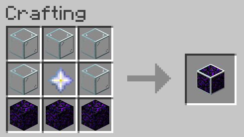
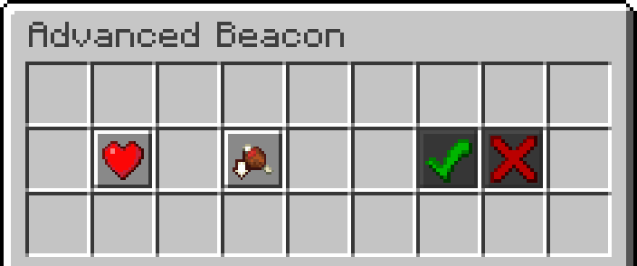

# **Advanced Beacons Datapack**
<em>Created by FancyPotatOS</em>

Adds a new beacon to your world! It functions along the same lines, with a block pyramid and the ability to set an Area of Effect.

## UI

### **Features**

- **Simple design** - Quick to figure out and easy to use
- **Almost all potion effects** - Most potion effects are available _yes, even the bad ones..._
    - The only ones not included are: Instant Damage/Health, omen effects, Hero of the Village, and Luck/Unluck
    - The bad effects can be disabled by setting the score `config.effects.disable_bad_effects advancedbeacon.master` to 1
        - **This doesn't wipe any beacons that have been set, however.**
- **Large Range** - Beacons now start a 15 block range and go up by 15 blocks per layer
- **Large Beacon** - Some of the best effects are behind the elusive 11x11 pyramid base! That's 285 blocks, or roughly 4 and a half stacks total!
